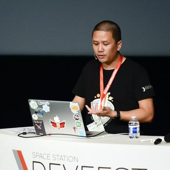

# Workshop Cypress

summary: Workshop pour apprendre Cypress
id: cypress-workshop-bdx
categories: Cypress
tags: bdx
status: Published
authors: Rodolphe Bung, Jordan Nourry
feedback link: TODO

<!-- ------------------------ -->

## Bienvenue

Duration: 90

Bienvenue dans ce workshop dédié à Cypress! Nous espérons qu'il vous plaira!

### Ce que vous allez apprendre

- Les bases de Cypress
- Les différents niveaux de tests
- Manipuler les requêtes XHR
- Faire une commande personnalisée
- Intégration des tests dans une CICD

### Documentation

- <https://docs.cypress.io/api/api/table-of-contents.html>

Positive
: This will appear in a positive info box.

Negative
: This will appear in a negative info box.

[Download SDK](https://www.google.com)

<!-- ------------------------ -->

## Avant de commencer

Duration: 10

### Pré-requis

- Avoir une connection internet
- Git
- NodeJs

### Télécharger le repo

```bash
git clone  https://github.com/JKratus/Cypress-Devoxx-Hands-on-Lab.git
```

### Installer le projet

```bash
npm install
```

### Vérifier que le tout fonctionne

Lancer l'application

```bash
npm start
```

Lancer Cypress

```bash
npx cypress open
```

<!-- ------------------------ -->

## Code Snippets

Duration: 3

To include code snippets you can do a few things.

- Inline highlighting can be done using the tiny tick mark on your keyboard: "`"
- Embedded code

### JavaScript

```javascript
{
  key1: "string",
  key2: integer,
  key3: "string"
}
```

### Java

```java
for (statement 1; statement 2; statement 3) {
  // code block to be executed
}
```

<!-- ------------------------ -->

## Hyperlinking and Embedded Images

Duration: 1### Hyperlinking
[Youtube - Halsey Playlists](https://www.youtube.com/user/iamhalsey/playlists)

### Images



<!-- ------------------------ -->

## Other Stuff

Duration: 1

Checkout the official documentation here: [Codelab Formatting Guide](https://github.com/googlecodelabs/tools/blob/master/FORMAT-GUIDE.md)
