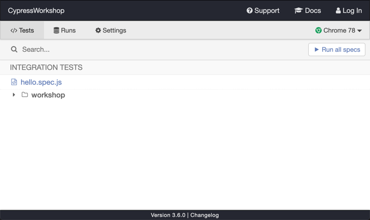
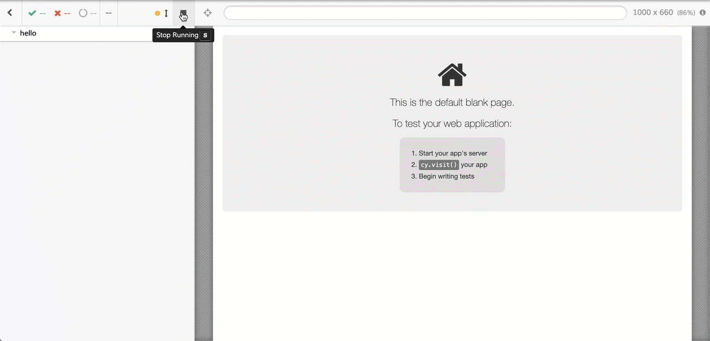

# Workshop Cypress

summary: Workshop pour apprendre Cypress
id: cypress-workshop-bdx
categories: Cypress
tags: bdx
status: Published
authors: Rodolphe Bung, Jordan Nourry
feedback link: TODO

<!-- ------------------------ -->

## Bienvenue 🤗

Duration: 10

Bienvenue dans ce workshop dédié à Cypress! Nous espérons qu'il vous plaira!

### Ce que vous allez apprendre

- Les bases de Cypress
- Les différents niveaux de tests
- Manipuler les requêtes XHR
- Faire une commande personnalisée
- Et d'autres choses si nous avons le temps!

### Pendant le workshop

N'hésitez pas à:

- à soliciter les animateurs du workshop
- aider les autres si vous avez déjà de l'expérience avec Cypress
- regarder la [documentation (très bien faite) de Cypress](https://docs.cypress.io/api/api/table-of-contents.html)

<!-- ------------------------ -->

## Avant de commencer ✋

Duration: 15

### Pré-requis

- Avoir une connection internet
- [Git](https://git-scm.com/downloads)
- [NodeJs](https://nodejs.org/en/download/)
- _Recommandé mais pas obligatoire_: [Visual Studio Code](https://code.visualstudio.com/)

Negative
: Si par hasard, vous accédez à internet via un proxy d'entreprise, pensez à jeter aussi un coup d'oeil sur [cette page](https://docs.cypress.io/guides/references/proxy-configuration.html) pour que Cypress fonctionne correctement

### Télécharger le repo

```bash
git clone  https://github.com/rbung/CypressWorkshop.git
```

### Installer le projet

```bash
cd CypressWorkshop
npm install
```

### Vérifier que le tout fonctionne

- Dans un terminal, lancer l'application

```bash
npm start
```

- Dans un autre terminal, lancer Cypress

```bash
npx cypress open
```

- L'interface suivante devrait s'afficher



- Lancer un test simple: cliquer sur le test `hello.spec.js`



Vous êtes maintenant prêt! 💪

<!-- ------------------------ -->

## Critical Flow 🚨

Duration: 15

Dans ce test, nous allons tester les principales fonctionnalités proposées par le site. L'objectif est de balayer l'ensemble des pages et de vérifier qu'elles sont correctement affichées. Nous allons aussi valider que les comportements de base fonctionnent correctement. A l'issue de cet exercice, vous serez familier avec les commandes de bases de Cypress: `cy.visit`, `cy.get`, `cy.title`, `should`, `click`, etc.

- Compléter les TODOs dans le fichier `cypress/integration/01-critical-flow.spec.js`

Positive
: Jouer avec le [Selector Playground](https://docs.cypress.io/api/cypress-api/selector-playground-api.html#Syntax) pour trouver les éléments sur lesquels vous allez faire des [assertions](https://docs.cypress.io/guides/references/assertions.html#Common-Assertions)

Positive
: Noter qu'à chaque sauvegarde de votre fichier de test, Cypress rejoue automatique le test. Il est en effet en mode [watch](https://docs.cypress.io/guides/core-concepts/writing-and-organizing-tests.html#Watching-tests) sur le répertoire `integration` 👀 Noter aussi que si vous utilisez un éditeur évolué (comme [VS Code](https://code.visualstudio.com/)), vous avez aussi la complétion, cela est grâce au fichier `cypress/tsconfig.json`. N'hésitez pas à regarder son contenu.

Negative
: La solution de l'exercice se trouve dans le fichier `cypress/integration/answers/01-critical-flow.answer.spec.js`

## Hooks et factorisation 👩‍💻

Duration: 15

Dans ce test, nous allons tester la fonctionnalité d'authentification de manière exhaustive.

- Dans l'interface de Cypress, arrêter le test de l'exercice précédent et exécuter le test `02-login.spec.js`
- Dans le fichier `cypress/integration/02-login.spec.js`, compléter the TODOs.
- Vous verrez qu'il y a des duplications dans le code au niveau de la commande `visit`. Pour y remédier, pensez que vous êtes dans un environnement `Mocha` : vous avez donc à votre disposition les [hooks](https://mochajs.org/#hooks)
- Autre duplication visible: la validation de la présence du message d'erreur. Vous pouvez écrire une fonction pour factoriser cette partie (`C'est juste du JavaScript` 😉)

Negative
: La solution de l'exercice se trouve dans le fichier `cypress/integration/answers/02-login.answer.spec.js`

## Intercepter les requêtes XHR 🤯

Duration: 15

Dans la première partie du test (celle concernant la partie non authentifié), on peut constater que les assertions sont très fines. Lorsqu'on lance le test, celui-ci échoue: l'article n'existe pas côté serveur (il a pu être modifié/supprimé).

Pour s'afficher, la page `article` lance 2 requêtes vers le serveur : une pour récupérer les informations relatives à l'article et une autre pour récupérer les commentaires liés à cet article.

Nous allons utiliser les commandes [cy.server](https://docs.cypress.io/api/commands/server.html) et [cy.route](https://docs.cypress.io/api/commands/route.html) pour contrôler les appels réseaux qui nous intéressent!

Une fois le premier test passé. Nous allons utilisé la commande `cy.route` en mode "pro" dans les autres tests pour simuler des erreurs (404, 500) ou avoir des temps de réponses différents et ainsi pouvoir facilement voir comment réagit notre site sur des cas limites.

- Dans l'interface de Cypress, arrêter le test de l'exercice précédent et exécuter le test `03-article.spec.js`
- Dans le fichier `cypress/integration/03-article.spec.js`, compléter les TODOs de la première série de tests (`context('In an anonymous context', ...`)

Positive
: Cypress vous indique clairement les requêtes XHR qui sont lancées lors de l'affichage de votre page (avec les lignes commençant par `(XHR)`). Lorsque que vous aurez intercepté et stubbé ces requêtes, Cypress préfixera ces lignes avec `(XHR stub)`. Cela validera que la définition de vos `cy.route` fonctionne 😉

Negative
: La solution de l'exercice se trouve dans le fichier `cypress/integration/answers/03-article.answer.spec.js`

## Les custom commands 😎

Duration: 15

Dans la deuxième partie du test, nous devons être authentifié. La fonctionnalité de `login` est importante dans notre site. Elle peut être aussi utilisée pour afficher la page de `settings` par exemple. Pour mutualiser du code à travers les différents tests, nous allons développer une [custom command](https://docs.cypress.io/api/cypress-api/custom-commands.html) qui nous permettra de nous authentifié facilement dans nos tests.

Si reprendre le code que l'on a vu lors dans notre test de la page `login` peut être tentant, ce n'est cependant pas la méthode la plus efficace. Plutôt que d'utiliser l'interface pour s'authentifier, nous allons le faire de manière programmatique ! 👨‍💻

Dans le fichier `commands.js` qui se trouve dans le répertoire `support`, la commande `login` est déjà déclarée pour vous. Utiliser la commande [cy.request](https://docs.cypress.io/api/commands/request.html) pour faire une requête `POST` sur le endpoint d'authentification `https://docs.cypress.io/api/commands/request.html` puis utiliser la réponse pour récupérer le token et le positionner dans le local storage pour être authentifié d'un point de vue applicatif !

```javascript
window.localStorage.setItem("jwt", token);
```

Positive
: Pour que votre `custom command` soit au top 👌 :<br/> - contrôler la manière dont elle loggue dans le panel de commande <https://docs.cypress.io/api/cypress-api/custom-commands.html#Command-Logging><br/> - faites un fichier de définition Typescript pour avoir la complétion de votre command <https://docs.cypress.io/api/cypress-api/custom-commands.html#5-Write-TypeScript-definitions>

## Bonus 🎁

Vous êtes arrivés jusque là dans le temps imparti, bravo! 🎉

Si vous avez encore du temps, nous pouvons voir les sujets suivants :

1. La CICD
2. Test unitaire de composant

## Bonus - CICD 🛠

Utiliser Cypress en local avec une interface graphique, c'est bien. Utiliser nos tests dans le cadre d'une intégration continue, c'est mieux ! Nous allons découvrir comment exécuter nos tests en mode _headless_, utiliser le _dashboard service_ de Cypress et une intégration continue sur le cloud : _CircleCI_.

### Le mode headless

La commande [run](https://docs.cypress.io/guides/guides/command-line.html#cypress-run) de Cypress permet de lancer nos tests en mode _headless_ (c'est-à-dire, sans avoir besoin d'interface graphique).

Dans le fichier `package.json`, définissez un script `cypress:run` qui va exécuter en mode _headless_ tous les tests contenu dans le dossier `cypress/integration/devoxx`.

```javascript
"cypress:run": "cypress run -s 'cypress/integration/devoxx/**'"
```

```bash
npm run cypress:run
```

### Enregistrer vos exécutions de tests

Negative
: Pré-requis : avoir un compte Github

Avec l'option [record](https://docs.cypress.io/guides/guides/command-line.html#cypress-run-record-key-lt-record-key-gt), nous allons pouvoir enregistrer différentes exécutions :

- Lancer l'interface de Cypress
- S'authentifier en cliquant sur le bouton `Log In` en haut à droite
- Une fois authentifié, vous pouvez maintenant aller sur la partie `Runs` de l'interface, ensuite cliquer sur le bouton `Set up project to record`
- Définissez un nom ainsi que l'organisation, puis valider (laissez votre projet en public)

Un `projectId` sera défini et sera automatiquement ajouté à votre fichier de configuration Cypress `cypress.json` 👌. Pensez à commité ce fichier.

Une ligne de commande `cypress run` sera affiché avec le paramètre `key` positionné. Prenez cette ligne de commande et exécutez-la dans votre terminal : votre test est en train d'être enregistré !

- Avec un navigateur, allez sur le [dashboard service](https://dashboard.cypress.io/#/login) et validez que vos tests sont bien présents
- Prenez le temps de découvrir le _dashboard_

### CICD sur le cloud

Dans cette partie, nous allons utiliser [CircleCI](https://circleci.com/). Cypress peut évidemment s'interfacer avec de nombreuses solutions de CI (voir les [exemples](https://docs.cypress.io/guides/guides/continuous-integration.html#Examples)). Cependant, la tâche est plus facile avec CircleCI grâce à l'[orbe Cypress](https://github.com/cypress-io/circleci-orb) !

1. Créez un compte sur CircleCI
2. Pushez le code du projet sur un _repository_ de votre compte Github
3. Dans CircleCI, déclarez votre projet fraichement créé (dans la partie `Add projects`)
4. Pensez à positionner la variable d'environnement `CYPRESS_RECORD_KEY` avec la clé qui a été généré en 1ère partie
5. Lancer un _build_ (via CircleCI ou en poussant du code votre _repository_)
6. Une fois le _build_ achevé, allez dans le [dashboard service](https://dashboard.cypress.io) et regardez les différents résultats des tests ainsi que leur temps d'exécution.

Comment ça marche ?

- Jetez un coup d'oeil au fichier `circle.yml`
- La [documentation Cypress](https://docs.cypress.io/guides/guides/continuous-integration.html#Example-CircleCI-Orb) relative à la CICD avec CircleCI
- La [documentation de l'orbe Cypress](https://github.com/cypress-io/circleci-orb)

<!-- ------------------------ -->

## Bonus - Test de composant 💃🕺

Dans ce test, nous allons tester un composant de manière isolé, en faisant le focus sur la bannière présente lorsqu'il n'y a pas d'utilisateur connecté.

L'application étant en React, nous allons utiliser le plugin [cypress-react-unit-test](https://github.com/bahmutov/cypress-react-unit-test)

- Dans le fichier `spec.js`, compléter the TODOs.

⚠️ La solution de l'exercice se trouve dans le fichier `answer.js` ⚠️

<!-- ------------------------ -->

## Merci 🙏

Duration: 5

Nous espérons que vous avez apprécié ce workshop et que vous allez très vite utiliser Cypress!

### Feedback


<https://openfeedback.io/3BQH3sLpx0EfLHHC7Wng/2019-11-15/33>

### Gagnez un tshirt Cypress

Remplissez le questionnaire: <https://link.cypress.io/rodolphe-f>

### Nous contacter

Sur Twitter

- [@JkNourry](https://twitter.com/JkNourry)
- [@rodbung](https://twitter.com/rodbung)
